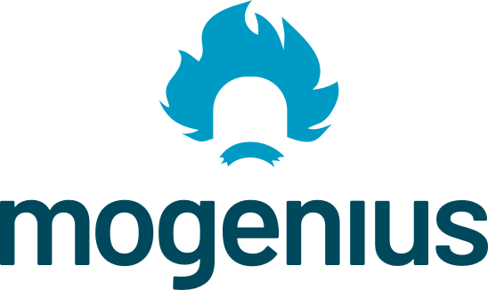

# README

<p align="center">
  
</p>

This is the public version of `mocli` repository for distribution purposes. It just contains the release versions of the binaries as tarballs.

`mocli` is a CLI tool with a TUI(terminal UI). It is written in Go with the help of package [tview](https://github.com/rivo/tview) to observe your [mogenius](https://mogenius.com/) projects 'n services from your CLI environment in style.

## Installation

Currently, we only support [Homebrew](https://brew.sh/)(for Mac 'n Linux) and [Scoop](https://scoop.sh/)(for Windows).

### Mac/Linux
Install [Homebrew](https://brew.sh/) if you haven't done so.

```
brew tap mogenius/mocli
brew install mocli
```

Then have fun! 😎

### Windows

Install [Scoop](https://scoop.sh/) if you haven't done so

```
scoop bucket add mogenius-cli https://github.com/mogenius/homebrew-mocli
scoop install mocli
```

Then have fun! 😎
