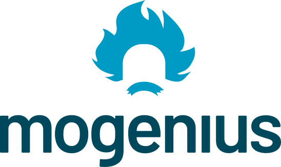
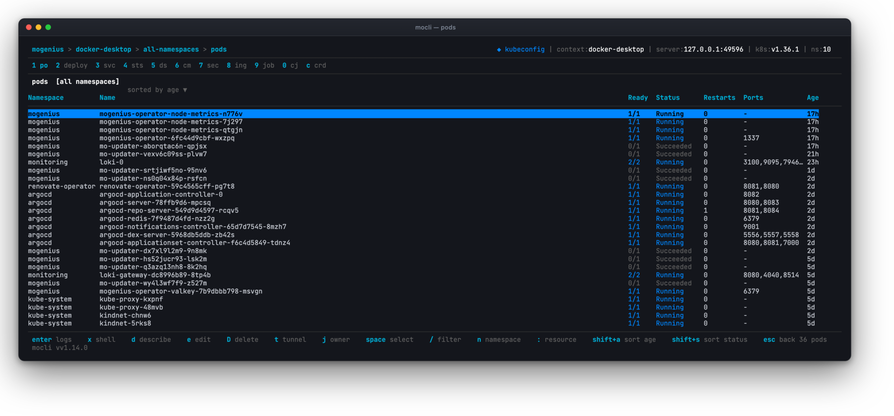
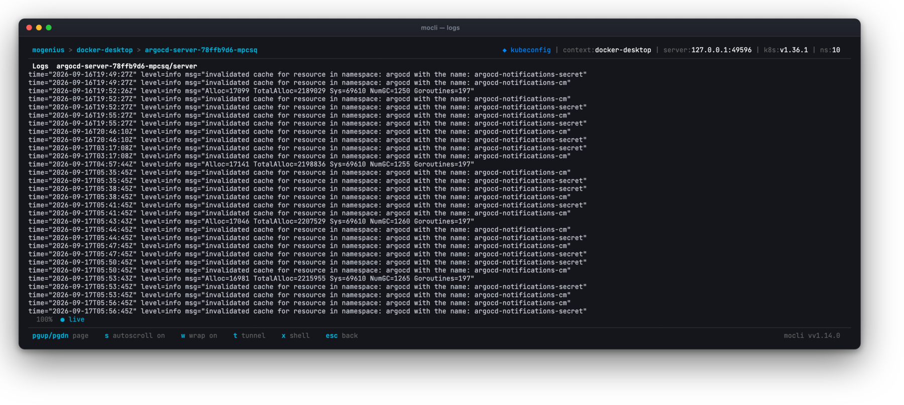
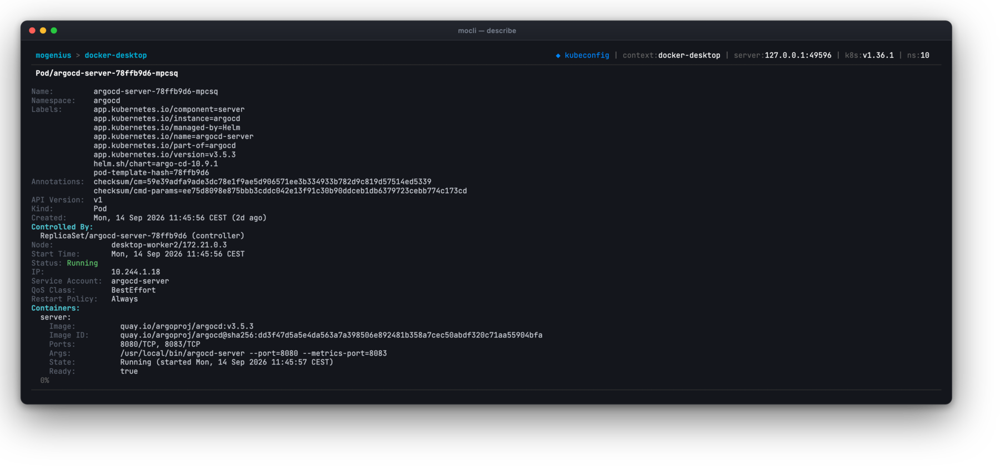
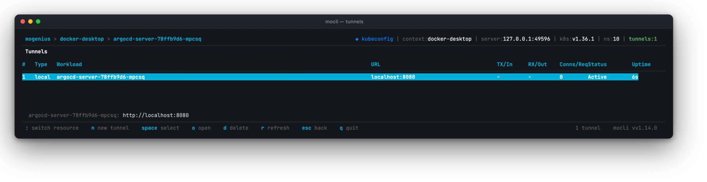
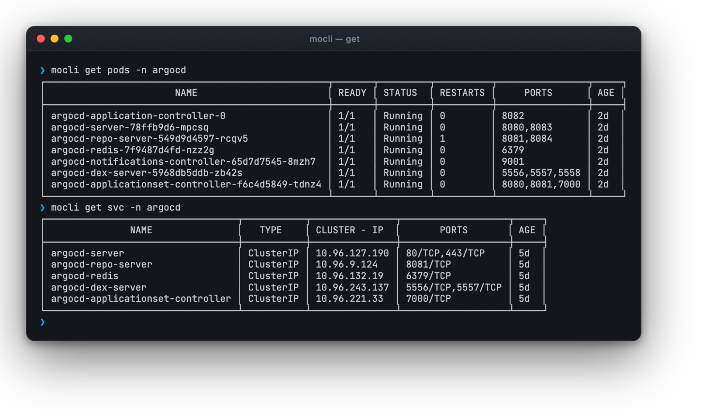

<div align="center">

<picture>
  <source media="(prefers-color-scheme: dark)" srcset="assets/logo-dark.png">
  
</picture>

# mocli

**Your cluster, in the terminal.**

A fast Kubernetes TUI and a kubectl-style CLI in a single binary —
for any cluster, with or without a mogenius account.

[](https://github.com/mogenius/homebrew-mocli/releases/latest)
[](https://github.com/mogenius/homebrew-mocli/releases)
[](#supported-platforms)

[Install](#install) · [Quick start](#quick-start) · [The TUI](#the-tui) · [The CLI](#the-cli) · [mogenius.com](https://mogenius.com)



</div>

---

## Why mocli

- **One binary, two tools.** A full-screen TUI for browsing and debugging, and a
  scriptable CLI with `get`, `apply`, `logs`, `wait` and friends for your pipelines.
- **Works with any cluster.** Point it at a kubeconfig and go — no operator, no
  account, no login. Connect it to [mogenius](https://mogenius.com) and you also get
  organizations, RBAC-enforced tunnels and public URLs on top.
- **Fast where it counts.** Server-side search and pagination, live log streaming,
  and a list that stays responsive while it loads.
- **No context juggling.** Every cluster mocli can reach — from your kubeconfig and
  from mogenius — shows up in one picker, and the choice is remembered.

## Install

### macOS & Linux — [Homebrew](https://brew.sh)

```sh
brew tap mogenius/mocli
brew trust mogenius/mocli
brew install mocli
```

### Windows — [Scoop](https://scoop.sh)

```sh
scoop bucket add mogenius-cli https://github.com/mogenius/homebrew-mocli
scoop install mocli
```

### Manual download

Grab the archive for your platform from the
[latest release](https://github.com/mogenius/homebrew-mocli/releases/latest),
unpack it and move the binary onto your `$PATH`:

```sh
tar -xzf mocli-v*-darwin-arm64.tar.gz
sudo mv mocli-v*-darwin-arm64 /usr/local/bin/mocli
```

### Shell completion

```sh
mocli completion install     # bash, zsh, fish and PowerShell
```

## Quick start

```sh
mocli                         # pick a cluster, then browse it
```

The first launch lists every cluster mocli can reach and remembers the one you pick
in `~/.mocli/context.yaml`. From there:

```sh
mocli tui                                  # straight into the terminal UI
mocli get pods -n argocd                   # kubectl-style, scriptable
mocli logs argocd-server-78ffb9d6 -f       # follow a container's logs
mocli shell my-pod -n staging              # interactive shell in a container
mocli port-forward -n staging -k Service -w api -p 8080:8080
```

Signing in to mogenius is optional and only needed for the platform features below:

```sh
mocli login
```

## Two ways to connect

mocli reaches a cluster either through the mogenius platform or straight through your
kubeconfig, and lists both sources side by side. Features a plain kubeconfig cluster
cannot provide are hidden rather than failing when you reach for them.

|                                                        | mogenius | kubeconfig           |
| ------------------------------------------------------ | :------: | :------------------: |
| Browse, describe, edit and delete resources             |    ✅    |          ✅          |
| Logs, shell, port-forward                               |    ✅    |          ✅          |
| Organizations and workspaces                            |    ✅    |          —           |
| Public tunnel URLs                                      |    ✅    |      local only      |
| RBAC-enforced access without handing out a kubeconfig   |    ✅    |          —           |
| `mocli ssh-proxy` / `setup-ssh`                         |    ✅    |          —           |
| Operator install and upgrade (`mocli cluster connect`)  |    ✅    |          —           |
| Pod CPU/RAM columns                                     |    ✅    | needs metrics-server |
| Server-side search and sorting                          |    ✅    |     done locally     |

```sh
mocli config get-contexts                     # every reachable cluster, both sources
mocli config use-context --context kind-dev   # pin a kubeconfig context
mocli config use-context --org acme --cluster prod -n acme-staging
mocli config current-context                  # what am I pointed at?
```

Standard kubeconfig resolution applies (`$KUBECONFIG`, then `~/.kube/config`),
including multi-file merging and `exec` credential plugins such as
`aws eks get-token` or `gke-gcloud-auth-plugin`.

## The TUI

`mocli tui` opens a full-screen view of the cluster. Number keys switch resource kind,
`/` filters, `:` jumps to any kind including CRDs, and `n` scopes to a namespace.

### Live logs

Stream a container's output, follow it, wrap it, page through it — then jump straight
into a shell or a tunnel from the same screen.



### Describe anything

`d` gives you the full describe output for the selected resource, without leaving the
list you were in.



### Port-forwards you can see

`t` opens a tunnel to a pod or service with its ports pre-detected, and every running
tunnel stays visible with throughput, connections and uptime.



### Keys

| Key          | Action                        | Key       | Action                 |
| ------------ | ----------------------------- | --------- | ---------------------- |
| `1`…`0`, `c` | Switch resource kind          | `enter`   | Logs                   |
| `:`          | Any resource kind, incl. CRDs | `x`       | Shell into a container |
| `n`          | Pick a namespace              | `d`       | Describe               |
| `/`          | Filter the list               | `e`       | Edit the manifest      |
| `shift+a`    | Sort by age                   | `t`       | Start a tunnel         |
| `shift+s`    | Sort by status                | `D`       | Delete                 |
| `space`      | Select for bulk actions       | `j`       | Jump to the owner      |
| `esc`        | Back                          | `q`       | Quit                   |

## The CLI

Every resource command works on either connection and takes the same flags, so the
same script runs against a mogenius cluster and a bare kubeconfig one.



```sh
# Read
mocli get pods -n acme-staging                  # table
mocli get deploy -n acme-staging -o wide        # wide
mocli get job db-migration -n acme-staging -o yaml
mocli get pods -n acme-staging -o name          # "pod/<name>" per line
mocli get crd                                   # cluster-scoped kinds, incl. CRDs
mocli get pods --search '!kube' --limit 50      # server-side search + pagination

# Write
mocli apply -f ./deployment.yaml                # create or update, idempotent
mocli create job --from=cronjob/nightly-backup -n acme-staging
mocli delete pod my-pod -n acme-staging -y

# Operate
mocli logs job/db-migration -f -n acme-staging
mocli shell my-pod -c app -n acme-staging
mocli port-forward -n acme-staging -k Deployment -w worker -p 3000:3000
mocli wait job/db-migration --for=condition=complete --timeout=5m -n acme-staging
```

Short names work everywhere (`po`, `deploy`, `svc`, `sts`, `ds`, `cj`, `cm`, `ing`, …).

### Connection flags

| Flag           | Meaning                                                     |
| -------------- | ----------------------------------------------------------- |
| `--kubeconfig` | Path to a kubeconfig file (implies a direct connection)      |
| `--context`    | kubeconfig context to use (implies a direct connection)      |
| `--direct`     | Use the kubeconfig's current-context                         |
| `--platform`   | Force the mogenius connection even if a direct one is saved  |

### In CI

`mocli wait` blocks until a Job completes or a Pod is ready, so a pipeline can apply a
manifest and then wait on the result. `-y` skips delete confirmations, and `-o name`
or `-o json` gives you output that is easy to pipe on.

```sh
mocli apply -f ./job.yaml -n ci
mocli wait job/db-migration --for=condition=complete --timeout=10m -n ci
mocli logs job/db-migration -n ci
```

## Supported platforms

| OS      | Architectures                    |
| ------- | -------------------------------- |
| macOS   | `arm64` (Apple silicon), `amd64` |
| Linux   | `amd64`, `arm64`, `arm`, `386`   |
| Windows | `amd64`                          |

## Update & uninstall

```sh
brew update && brew upgrade mocli      # macOS / Linux
scoop update mocli                     # Windows

brew uninstall mocli && brew untap mogenius/mocli
scoop uninstall mocli
```

Configuration lives in `~/.mocli/` (`config.yaml`, `context.yaml`); remove that
directory to reset mocli completely.

## Self-hosted mogenius

Running mocli against a dedicated or self-hosted mogenius instance? Set `stage` to
`custom` in `~/.mocli/config.yaml` and point the service URLs at your instance —
`custom` opts out of the automatic config reset, so your URLs survive updates.

```yaml
app:
  environment:
    stage: "custom"

services:
  api: "https://platform-api.your-instance.com/"
  user: "https://platform-user.your-instance.com/"
  platform: "https://app.your-instance.com/"
  ws: "wss://k8s-cmd-stream.your-instance.com"
  socket: "https://platform-ws.your-instance.com"
```

## About this repository

This is the public distribution repository for mocli: the Homebrew tap, the Scoop
manifest and the release binaries. The source lives in a private repository.

- 🐛 **Found a bug or missing a feature?** [Open an issue](https://github.com/mogenius/homebrew-mocli/issues)
- 📦 **All versions:** [Releases](https://github.com/mogenius/homebrew-mocli/releases)
- 📚 **Platform docs:** [docs.mogenius.com](https://docs.mogenius.com)
- 🌍 **mogenius:** [mogenius.com](https://mogenius.com)

## License

mocli is commercial software by mogenius GmbH. See
[mogenius.com](https://mogenius.com) for terms and licensing.
